# Домашнее задание №1

**Тема:** базовая настройка коммутатора Cisco
**Стенд:** EVE-NG (VMware) + образ Cisco IOL + VPC / Linux TinyCore
**Подключение к устройствам:** PuTTY (Telnet как транспорт виртуальной консоли)

---

## Часть 1. Создание сети и проверка настроек коммутатора по умолчанию

Решил действовать «по-взрослому» — установил EVE-NG.

1. Добавил образ Cisco в EVE-NG, как указано в инструкции.
2. Запустил EVE-NG в VMware.
3. Добавил два устройства — коммутатор Cisco и VPC.

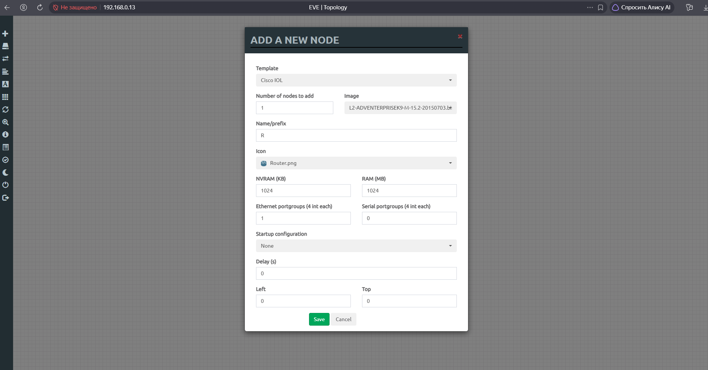

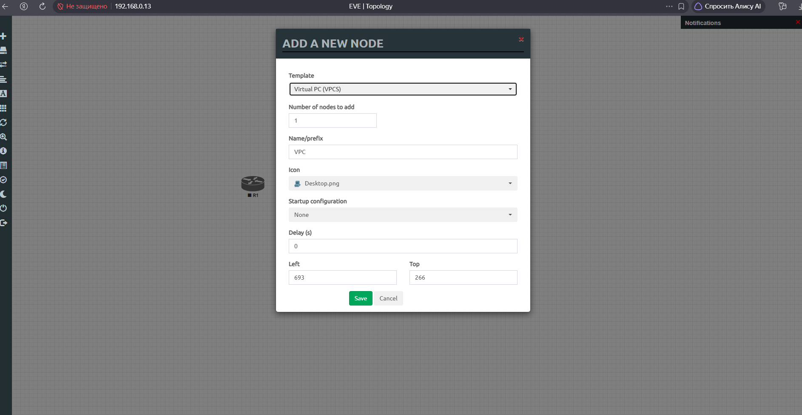

### Шаг 1. Создание сети согласно топологии

Тут столкнулся с первой проблемой: попытался подключить VPC к Cisco через serial port, которого в VPC нет.

Тогда по совету нейронки установил в EVE-NG лёгкий образ **linux-tinycore** — нейронка со всей ответственностью утверждала, что 1000 раз так делала и в TinyCore мы без труда настроим serial port.

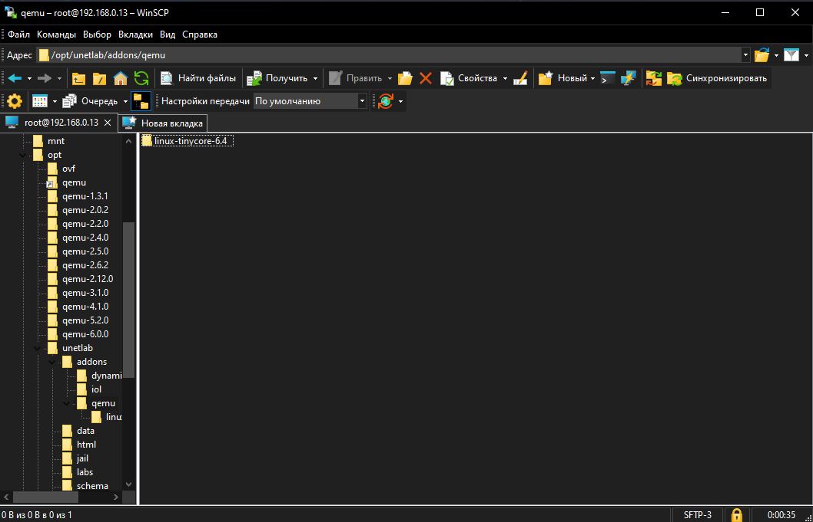

После установки linux-tinycore и ряда приседаний с настройкой QEMU custom options мне всё же удалось запустить TinyCore. Подключился к TinyCore через PuTTY — и застрял с serial port.

ИИ заявил, что зря мы всё это затеяли: процедура настройки serial port нетривиальная, для этого понадобятся сторонние программы, и вообще — почему бы не подключиться к коммутатору напрямую.

*Удалил нейронку.*

Попробовал подключиться к коммутатору напрямую, но так как я не знал порт свича и команду для вывода всех прослушиваемых портов — установил нейронку обратно.

Список открытых портов выудил командой:

```bash
netstat -tulpn | grep LISTEN
```

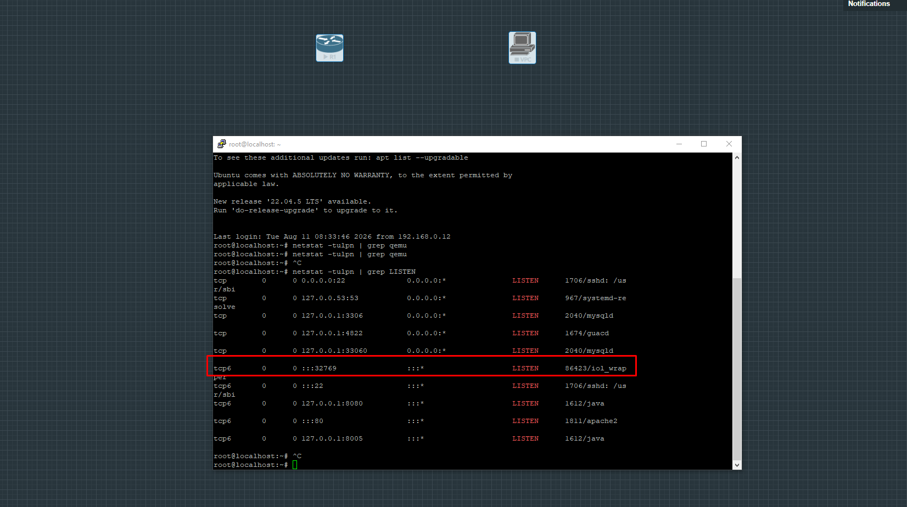

По знакомому названию `iol` определил коммутатор и подключился через PuTTY (тоже не с первого раза, так как пытался использовать SSH).

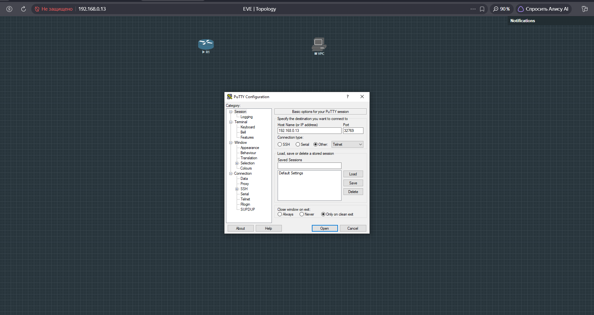

Свитч предложил провести базовую настройку — если я правильно понял, я отказался. Далее он предложил отказаться от **Autoinstall**, на что я ответил `no`.

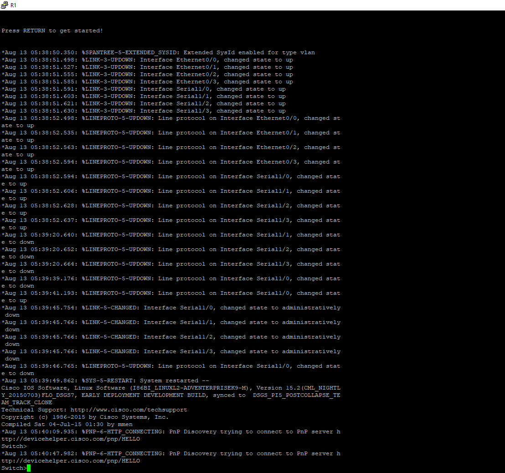

#### Ответы на вопросы

**1. Почему нужно использовать консольное подключение для первоначальной настройки коммутатора?**

Насколько понимаю, изначально на коммутаторе не настроен IP для подключения по сети.

**2. Почему нельзя подключиться к коммутатору через Telnet или SSH?**

По той же причине: это протоколы для подключения по сети, и пока сеть не настроена, подключение возможно только напрямую через serial port.

> **Замечание.** Поначалу у меня возник вопрос: почему при подключении через PuTTY к свичу в EVE-NG используется Telnet? Оказалось, что подключение к свичу в EVE-NG напрямую через PuTTY происходит не по сети (Telnet/SSH), а через виртуальный консольный кабель. Просто EVE-NG использует протокол Telnet как транспорт для передачи данных этого виртуального последовательного порта.

### Шаг 2. Проверка настроек коммутатора по умолчанию

#### b. Изучите текущий файл running configuration

**1. Сколько интерфейсов FastEthernet имеется на коммутаторе 2960?**

В выводе `running-config` интерфейсы `FastEthernet` отсутствуют. Присутствуют только `Ethernet0/0–0/3` и `Serial1/0–1/3`. Это особенность эмулятора IOL, где интерфейсы именуются `Ethernet`, а не `FastEthernet`.

**2. Сколько интерфейсов Gigabit Ethernet имеется на коммутаторе 2960?**

Интерфейсов `GigabitEthernet` в конфигурации нет.

**3. Каков диапазон значений, отображаемых в vty-линиях?**

В конфигурации указан диапазон `line vty 0 4` — то есть настроены линии с 0 по 4, всего 5 линий для удалённого доступа.

#### c. Изучите файл загрузочной конфигурации (startup configuration)


**Почему появляется это сообщение?** (сообщение об отсутствии startup-config)

При выполнении команды `show startup-config` появляется сообщение вида `startup-config is not present` (или пустой вывод), потому что **конфигурация не была сохранена** в NVRAM. В текущей сессии изменения существуют только в `running-config` (оперативной памяти). Чтобы startup-config появился, нужно выполнить `write memory` или `copy running-config startup-config`.

#### d. Изучите характеристики SVI для VLAN 1

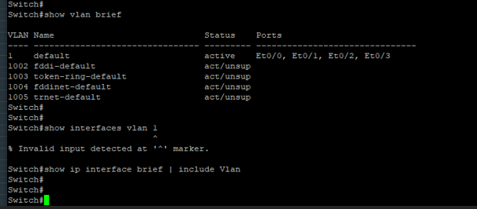

**1. Назначен ли IP-адрес сети VLAN 1?**

В `running-config` отсутствует блок `interface Vlan1`, следовательно, IP-адрес не назначен.

**2. Данный интерфейс включён?**

Нет, интерфейс вообще не существует. Поскольку блок `interface Vlan1` не создан, никакого SVI для VLAN 1 в системе нет.

#### e. Изучите IP-свойства интерфейса SVI сети VLAN 1

**Какие выходные данные вы видите?**

При выполнении команды `show interfaces vlan 1` будет получена ошибка:

```
% Invalid input detected at '^' marker.
```

или

```
Interface Vlan1 does not exist
```

Это происходит потому, что интерфейс SVI для VLAN 1 не создан в конфигурации.

#### f. Подсоедините кабель Ethernet компьютера PC-A к порту 6 на коммутаторе и изучите IP-свойства интерфейса SVI сети VLAN 1

Так как в задании сказано выполнить подключение к 6 порту, увеличил количество портов до 8 в настройках ноды и перезапустил её.

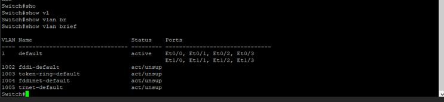

Подключил Ethernet в 6 порт.

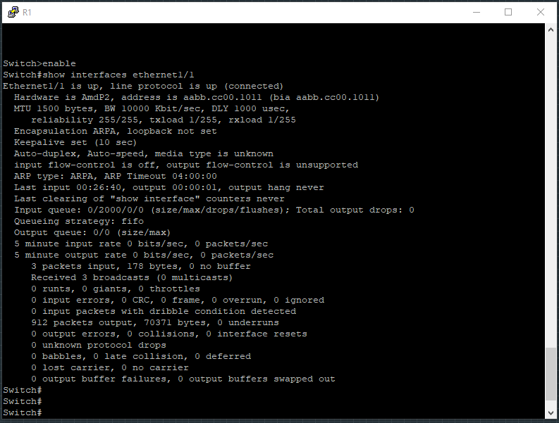

**Какие выходные данные вы видите?**

При выполнении команды `show interfaces ethernet1/1` видно, что порт физически подключён к ПК (состояние `up/up`). Параметры скорости и дуплекса согласованы автоматически (`Auto-duplex`, `Auto-speed`). Однако данный вывод не показывает IP-свойства SVI VLAN 1, так как это информация только о физическом интерфейсе.

#### g. Изучите сведения о версии ОС Cisco IOS на коммутаторе

**1. Под управлением какой версии ОС Cisco IOS работает коммутатор?**

`15.2(CML_NIGHTLY_20150703)FLO_DSGS7` — экспериментальная сборка для IOL.

**2. Как называется файл образа системы?**

`L2-ADVENTERPRISEK9-M-15.2-20150703.b`

Полный путь: `unix:/opt/unetlab/addons/iol/bin/L2-ADVENTERPRISEK9-M-15.2-20150703.b`

#### h. Изучите свойства по умолчанию интерфейса FastEthernet, который используется компьютером PC-A

Команда: `Switch# show interface f0/6` (в моём случае — порт Ethernet, к которому подключён PC-A).

**1. Интерфейс включён или выключен?**

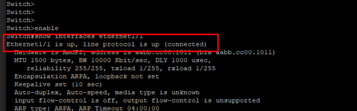

Включён (состояние `up/up`).

**2. Что нужно сделать, чтобы включить интерфейс?**

Чтобы включить интерфейс, необходимо перейти в режим конфигурации интерфейса и выполнить команду `no shutdown`.

#### i. Изучите флеш-память

**Какое имя присвоено образу Cisco IOS?**

В моей среде IOL команды `show flash:` и `dir flash:` не работают (флеш-память не эмулируется). Но имя образа известно из `show version` — это **`L2-ADVENTERPRISEK9-M-15.2-20150703.b`**.

---

## Часть 2. Настройка базовых параметров сетевых устройств

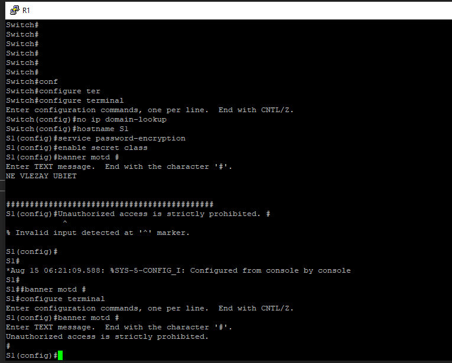

### a. В режиме глобальной конфигурации скопируйте базовые параметры конфигурации и вставьте их в файл на коммутаторе S1

Итак, перешёл в режим конфигурации, после чего настроил:

| Команда | Назначение |
|---|---|
| `no ip domain-lookup` | отключает автоматическое преобразование неправильно введённых команд в DNS-запросы |
| `hostname S1` | имя устройства |
| `service password-encryption` | включение слабого шифрования всех паролей |
| `enable secret class` | пароль для доступа к привилегированному режиму (`enable`) |
| `banner motd # ... #` | баннер при входе |

С вводом текстового сообщения баннера маленько запутался: сначала ввёл своё, но потом поправил.

### b. Назначьте IP-адрес интерфейсу SVI на коммутаторе

Благодаря этому появится возможность удалённого управления коммутатором.

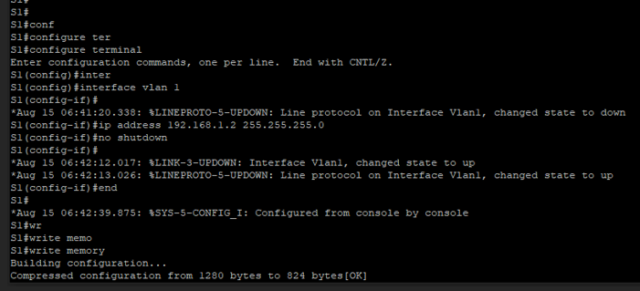

Зашёл в режим глобальных настроек и ввёл:

```cisco
S1(config)# interface vlan 1
S1(config-if)# ip address 192.168.1.2 255.255.255.0
S1(config-if)# no shutdown
S1# write memory
S1# show interfaces vlan 1
```

- `interface vlan 1` — после этой команды теоретически должен был создаться SVI (которого до этого не было) для VLAN 1;
- `ip address 192.168.1.2 255.255.255.0` — установил IP и маску;
- `no shutdown` — активировал интерфейс, потому как после создания SVI он был отключён;
- `write memory` — сохранил конфигурацию;
- `show interfaces vlan 1` — проверил, что появился IP и создался SVI.

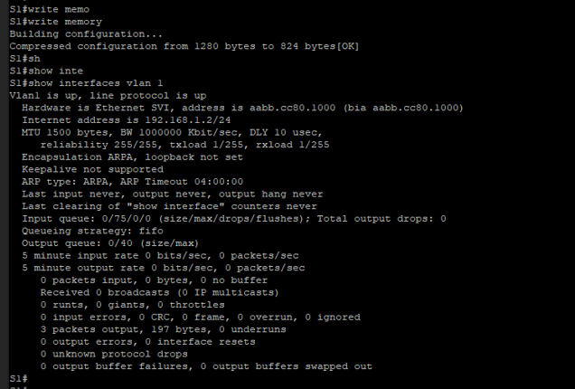

### c. Ограничьте доступ через порт консоли паролем

В качестве пароля для входа в консоль используется `cisco`. Конфигурация по умолчанию разрешает все консольные подключения без пароля. Чтобы консольные сообщения не прерывали выполнение команд, используется параметр `logging synchronous`.

```cisco
S1(config)# line con 0
S1(config-line)# password cisco
S1(config-line)# login
S1(config-line)# logging synchronous
S1(config-line)# end
```

- `line con 0` — вход в режим настройки консольного порта (консольная линия 0);
- `password cisco` — пароль для доступа через консоль;
- `login` — **включает проверку пароля при входе через консоль. Без этой команды пароль не запрашивается!**
- `logging synchronous` — предотвращает прерывание ввода команд системными сообщениями;
- `end` — выход из режима конфигурации.

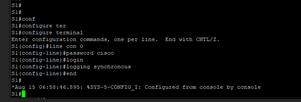

### d. Настройте каналы виртуального соединения (vty) для удалённого управления

Если не настроить пароль VTY, будет невозможно подключиться к коммутатору по протоколу Telnet.

```cisco
S1(config)# line vty 0 4
S1(config-line)# password cisco
S1(config-line)# login
S1(config-line)# transport input telnet
```

- `line vty 0 4` — переключает на настройку всех пяти виртуальных линий (с 0 по 4) для удалённого доступа;
- `password cisco` — задаёт пароль, который будет запрашиваться при подключении;
- `login` — активирует проверку пароля на этих линиях;
- `transport input telnet` — явно разрешает входящие подключения по протоколу Telnet.

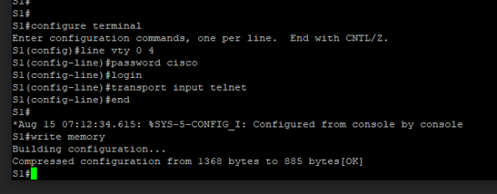

С помощью `show running-config` проверил настройки.

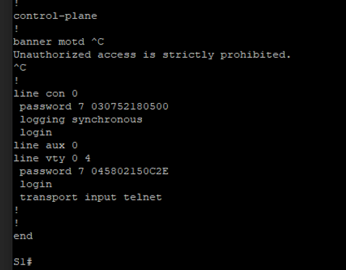

---

## Часть 3. Проверка сетевых подключений

### Шаг 1. Отображение конфигурации коммутатора

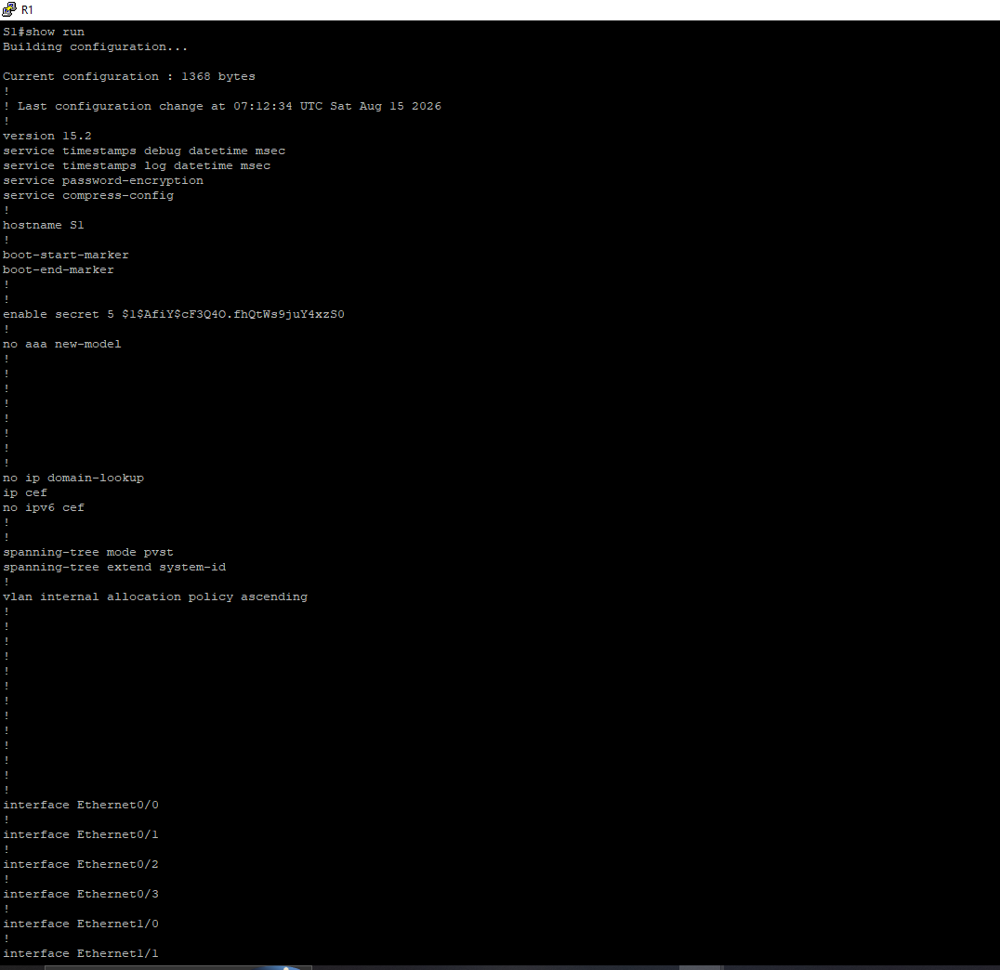

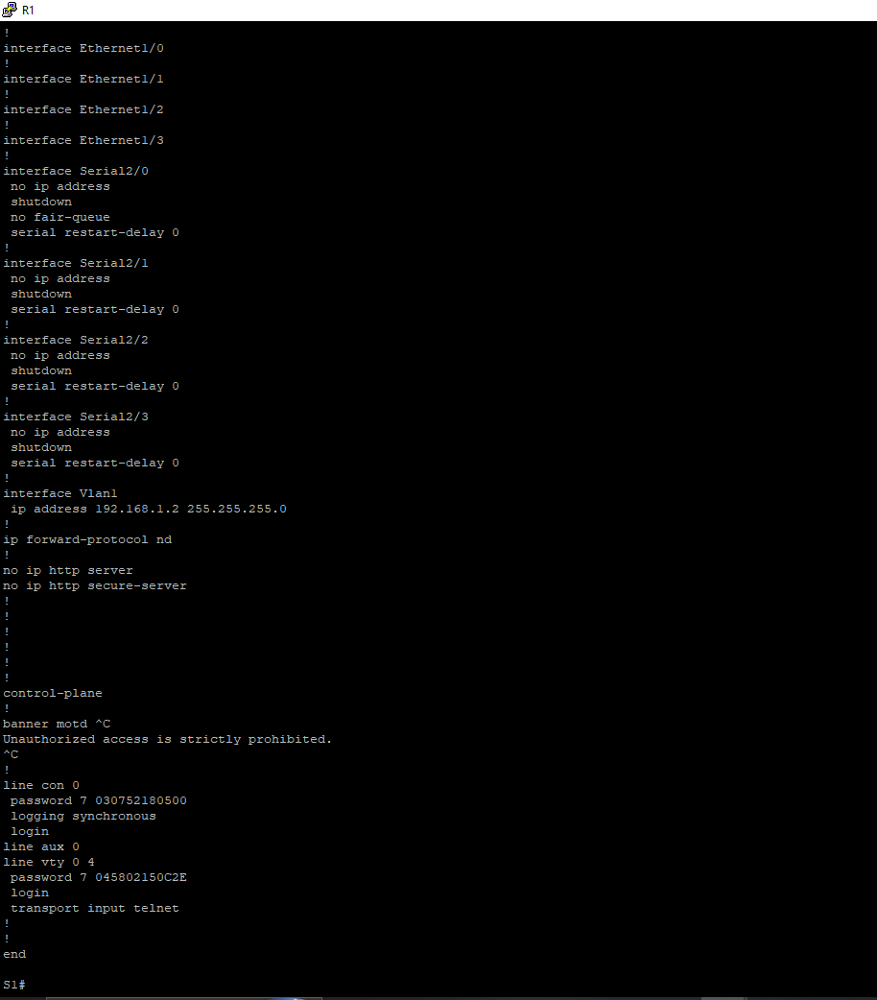

### Шаг 2. Тестирование сквозного соединения

Чтобы протестировать сквозное соединение с VPC, подключился к нему через PuTTY по Telnet, так же узнав порт с помощью `netstat`.

Установил на нём IP, маску и шлюз:

```
ip 192.168.1.10 255.255.255.0 192.168.1.1
```

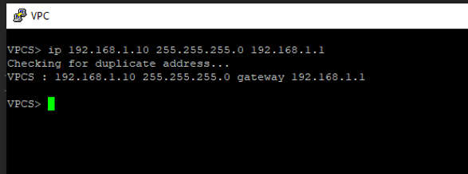

Пинг на VPC прошёл — 4/5 успешных ответов.

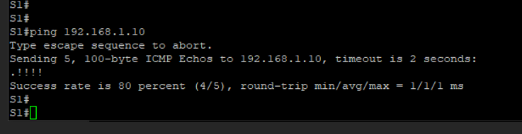

С VPC пинг так же проходит.

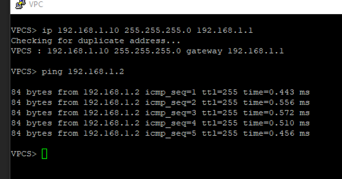

### Шаг 3. Проверка удалённого управления коммутатором S1

И снова столкнулся с проблемой — Telnet в VPC не работает.

Поменял VPC на Linux TinyCore (всё-таки не зря я с ним мучился). После ряда приседаний удалось подключиться к Linux, а оттуда — к коммутатору.

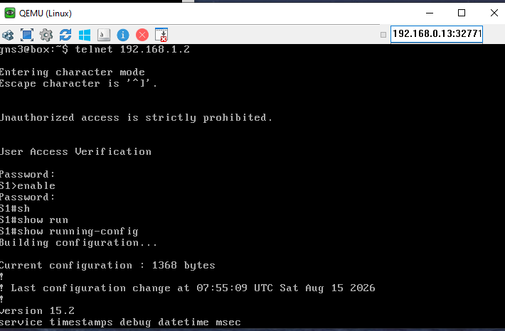

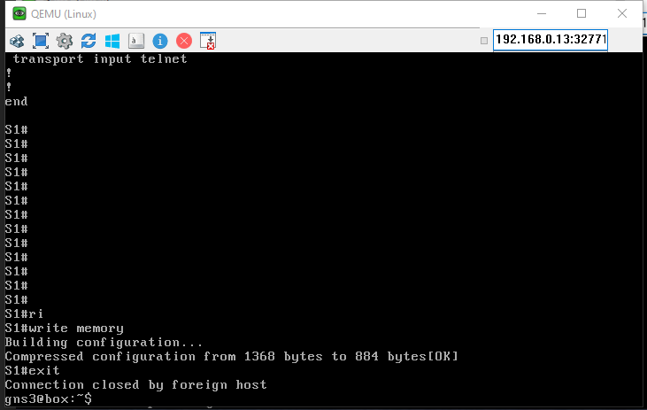

#### Ответы на вопросы

**1. Зачем необходимо настраивать пароль VTY для коммутатора?**

Без пароля коммутатор не разрешит входящие сетевые подключения, даже если IP-адрес уже назначен.

**2. Что нужно сделать, чтобы пароли не отправлялись в незашифрованном виде?**

Для этого нужно использовать **протокол SSH** вместо Telnet. Telnet передаёт всю информацию (включая пароли) в открытом виде, а SSH шифрует весь трафик. Чтобы перейти на SSH, на коммутаторе необходимо включить SSH на VTY-линиях (`transport input ssh`) и отключить Telnet (`no transport input telnet` или `transport input ssh`).
