# Домашнее задание №2

**Тема:** просмотр таблицы MAC-адресов коммутатора и ARP-кэша
**Стенд:** EVE-NG (VMware) + образ Cisco IOL, узлы S1, S2, PC-A, PC-B
**Основа:** топология из первого домашнего задания

---

## Часть 1. Настройка устройств

В качестве основы я использовал проект из первого домашнего задания, поэтому коммутатор S1 и PC-A у меня предварительно настроены. Проверим их текущие параметры командой `show running-config`.

### S1 — исходное состояние

| Параметр | Значение |
|---|---|
| Hostname | `S1` |
| IP | `192.168.1.2` |
| VTY password | `cisco` |
| EXEC password | `class` |

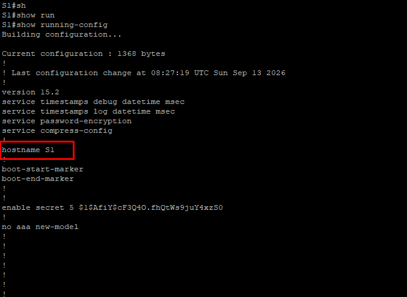

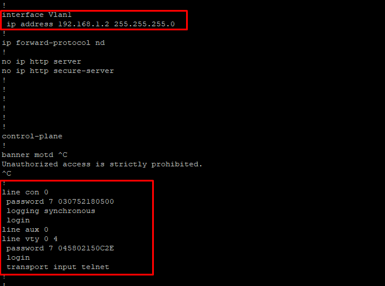

> Пароли в первозданном виде не посмотреть, так как включено шифрование (`service password-encryption`).

Исправим IP в соответствии с ТЗ.

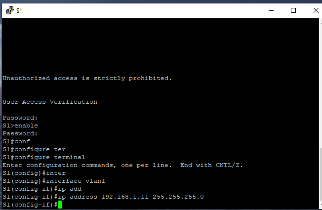

### PC-A — исходное состояние

| Параметр | Значение |
|---|---|
| Hostname | `box` |
| IP | не задан |

Поправим hostname.

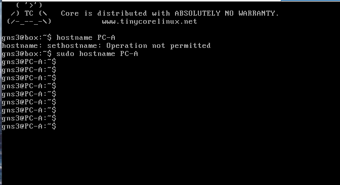

Установим IP.

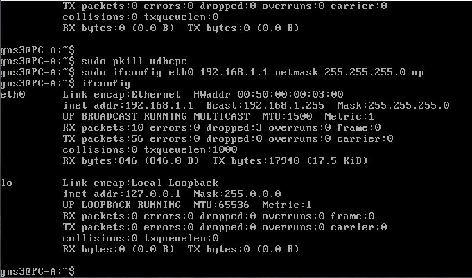

### Настройка коммутатора S2

Устанавливаем hostname.

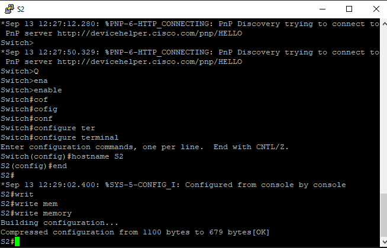

Задаём IP.

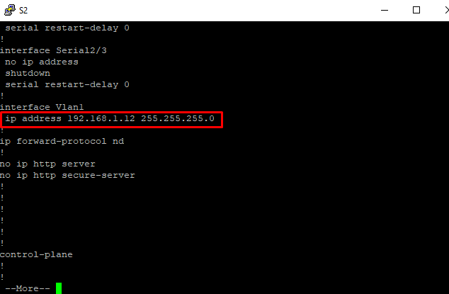

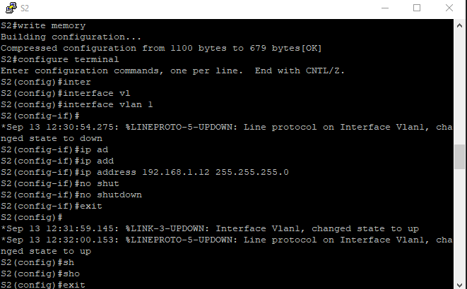

Пароль VTY.

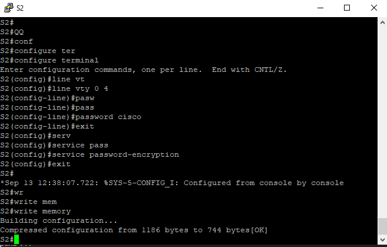

Пароль EXEC.

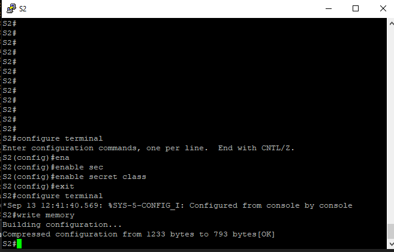

### Настройка PC-B

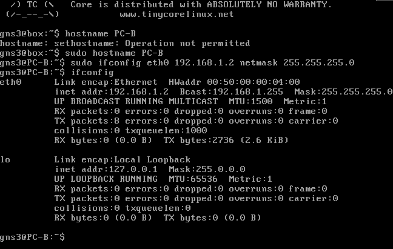

Все 4 устройства настроены.

Попробовал ради интереса пингануть с PC-A компьютер PC-B.

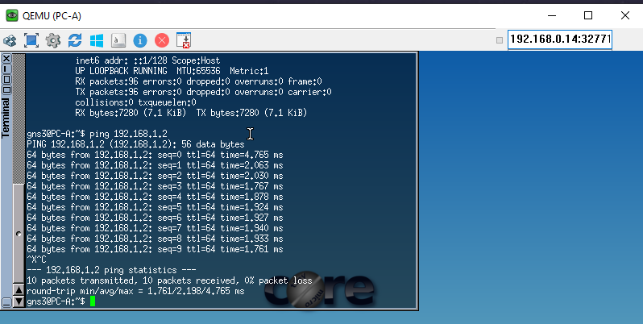

Пинг идёт.

---

## Часть 2. Изучение таблицы MAC-адресов

### Шаг 1. Определение MAC-адресов устройств

| Устройство / интерфейс | MAC-адрес |
|---|---|
| PC-A | `00:50:00:00:03:00` |
| PC-B | `00:50:00:00:04:00` |
| S1, FastEthernet 1/2 | `aa:bb:cc:00:10:21` |
| S2, FastEthernet 0/0 | `aa:bb:cc:00:20:00` |

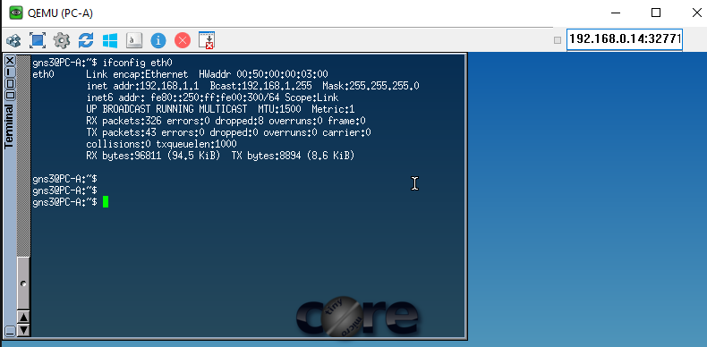

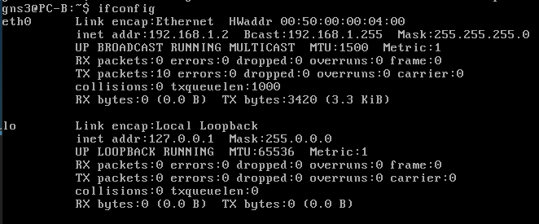

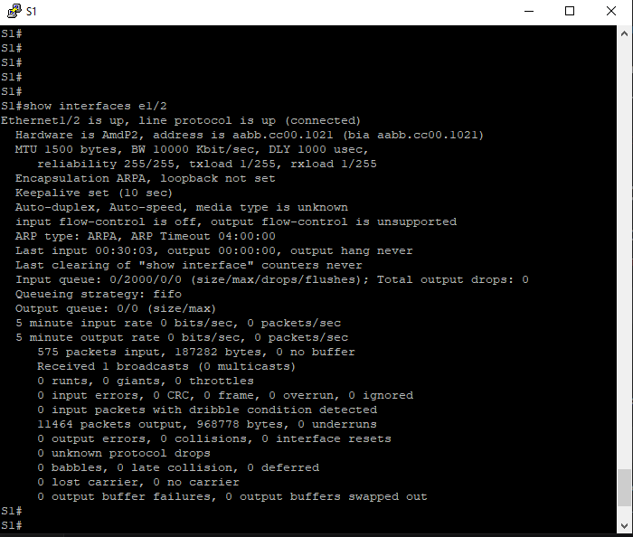

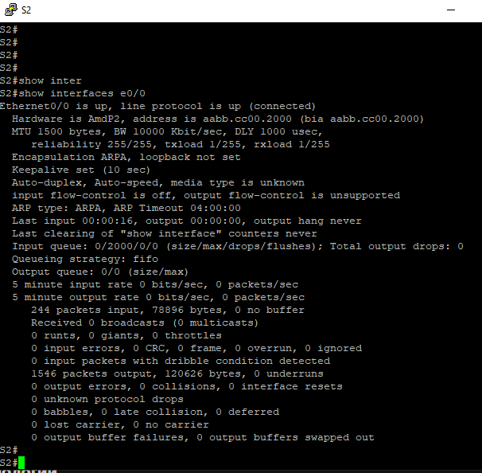

### Шаг 2. Просмотр таблицы MAC-адресов коммутатора

Посмотрим текущие MAC-адреса.

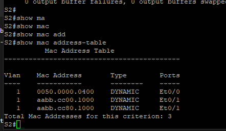

Разбор записей:

1. Первая запись — это PC-B.
2. Записи 2 и 3 — MAC-адреса самого S1:
   - MAC порта, к которому подключён S2;
   - MAC-адрес интерфейса VLAN 1 на S1.

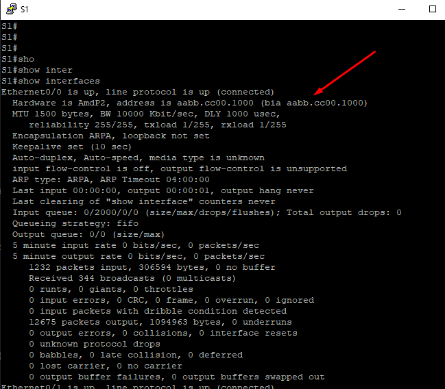

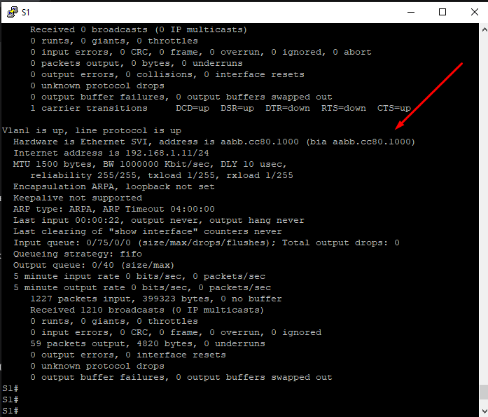

Определить «хозяина» каждого MAC-адреса, представленного в таблице, можно по портам, к которым они подключены.

> Данное решение работает ограниченное время, так как эти MAC-адреса являются динамическими и удаляются через определённый интервал (по умолчанию порядка 300 секунд).

Так как в списке нет PC-A, пинганул его, чтобы посмотреть — появится ли MAC-адрес в таблице.

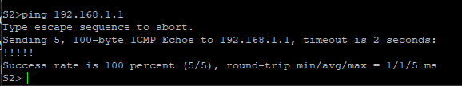

MAC-адрес PC-A появился на первом месте.

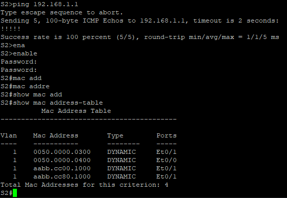

### Шаг 3. Очистка таблицы MAC-адресов

Очистил таблицу MAC-адресов и проверил, что она пуста.

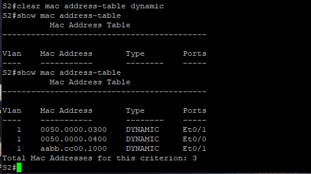

После повторной загрузки таблицы появились MAC-адреса всех подключённых устройств.

### Шаг 4. Проверка ARP-кэша

Выполнил команду `arp -a`, но уже после того, как пинганул PC-A.

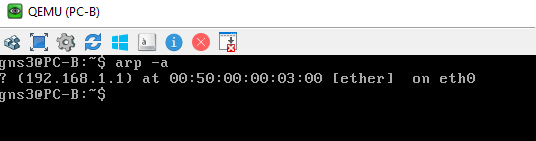

Пинганул оба коммутатора — их MAC-адреса так же сохранились.

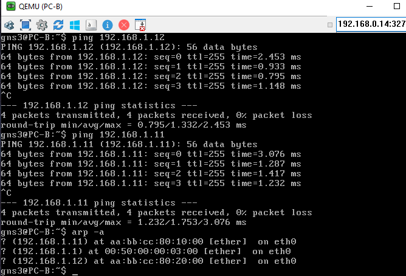

В таблице MAC-адресов S2 появился MAC-адрес S1.

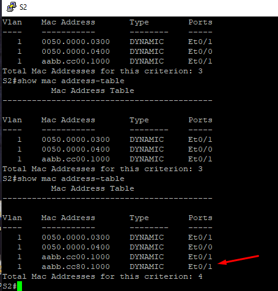

При пинге с PC-B устройств, находящихся за S2, тот отправил кадры на S1 и получил MAC-адрес S1.

### Ответ на контрольный вопрос

> **Вопрос.** В сетях Ethernet данные передаются на устройства по соответствующим MAC-адресам. Для этого коммутаторы и компьютеры динамически создают ARP-кэш и таблицы MAC-адресов. Если компьютеров в сети немного, эта процедура выглядит достаточно простой. Какие сложности могут возникнуть в крупных сетях?

Насколько я понял, основная проблема — это переполнение таблицы MAC-адресов, что приводит к сбросу старых записей и повторным ARP-запросам, а это увеличивает задержки.
